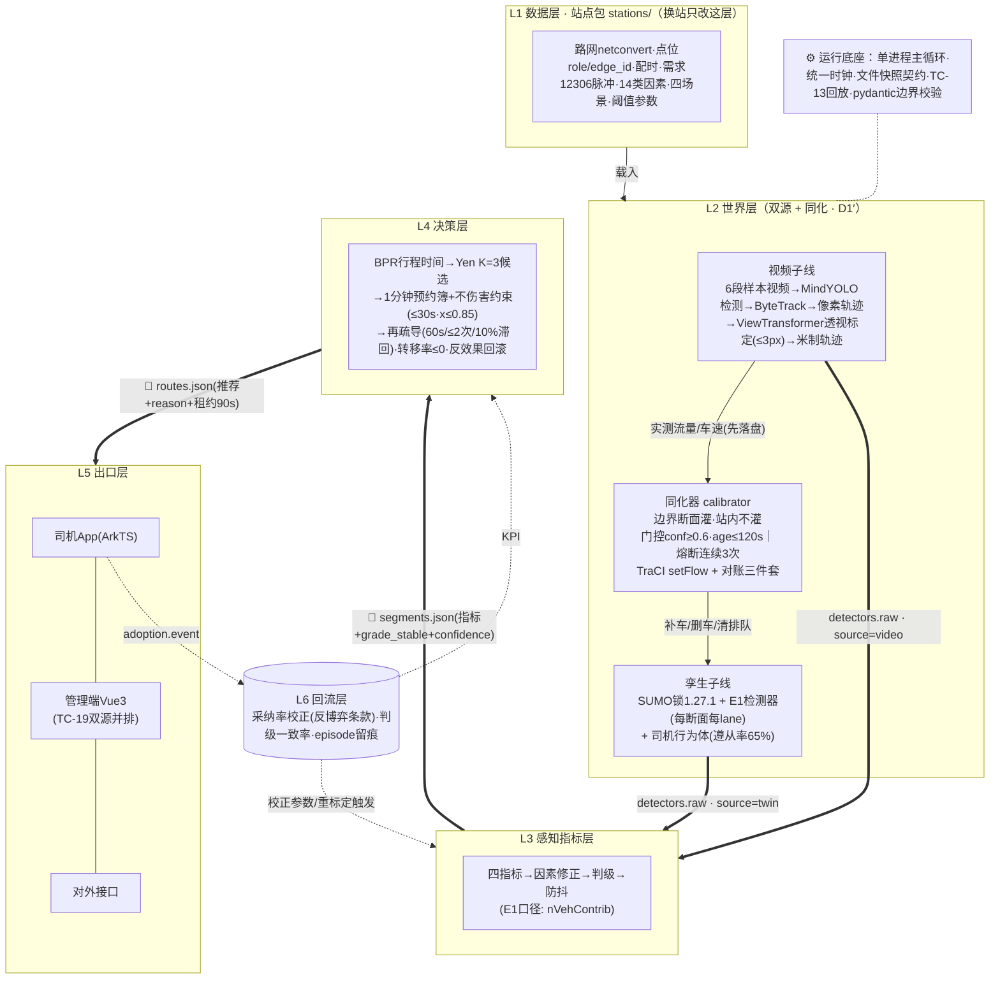

# HubFlow 系统架构（一期 · 双数据源版）

> **⚠ 状态：参考资料（已降级）**——按"中心定人/契约/要求，内部自设计"的治理模式，本文的实现细节（Yen/RANSAC/calibrator 参数等）不再是规范，仅作为各 owner 写 `work/<module>/DESIGN.md` 时的建议库。中心文档见 [`01~04`](./01-分工与验收表.md)。**⚠️ 原写「量纲错误（BPR `(x/c)` 应为 `x^β`）与观测契约缺口已由 hubflow-plan/02 补丁修正」是错的**（2026-10-10 核对）：`02` 的四个补丁 P1~P4 **没有一个涉及 BPR**，**该量纲错误至今未修**，手册第 4.2 / 7.3 / 14.4 节与附录 B-3（共 5 行）仍是 `t⁰·[1+α(x/c)^β]`；观测契约（`detectors.raw` 等）也**一条都没并入**。已登记 [#46](https://github.com/ouu2006/hubflow/issues/46) 与 [#47](https://github.com/ouu2006/hubflow/issues/47)。
> 性质：**架构参考**（切层依据 + 层职责表 + 总体架构图 + 契约清单 + 自检五问）。
> 版本：v1.0（2026-10-10）。对应计划口径：PR #17「一期双数据源（D1′）+ 数据同化」。
> 数据依据：[`../hubflow-data/00_数据收集总索引`](../hubflow-data/00_数据收集总索引.md) 五份调研文档（文中以〔01§2〕等标注出处）。
> 落位：本文件完成后拷贝至 HubFlow 仓库 `docs/系统架构.md`。

---

## 1. 切层依据（四条）

1. **沿数据流切**：原始观测 → 指标判级 → 决策 → 呈现 → 回流，每段一层。
2. **沿替换点切**：凡是二期要换的（视频源→实时摄像头流、车辆位置→App 定位）必须收在同一层内——即 L2「双源世界层」；换源时 L3~L6 零改动（契约 `source` 字段不变）。
3. **沿干预边界切（D1′ 新增）**：同化只发生在**边界断面**、站内不灌——calibrator 会删车，站内布设与自生成需求打架〔03§3.6，技术上是必须的〕。这是 L2 内部子件划分的硬依据。
4. **层间只许契约通过**：一期契约的物理形态 = 文件快照（`segments.json` / `routes.json` / …），配 pydantic/jsonschema 在层边界强制校验，坏契约直接 crash。

## 2. 层职责表

| 层 | 组成（模块 → 数据依据） | 核心职责 | 对上输出（契约） | 明确不负责 |
|---|---|---|---|---|
| **L1 数据层**（站点包 `stations/`） | 路网（netconvert 推荐参数组〔03§1.1〕）；点位表（`role=boundary/internal` + `sumo_edge_id`，PR#17/T1 模板）；配时（踏勘补）；需求（12306 时刻表 × 日均 2.1 万人次脉冲基线〔01§1〕）；14 类因素；四场景（平峰/峰值/突发〔PR#13〕）；阈值与参数（BPR α∈[0.6,1.7]/β∈[2,2.9] 按等级分组、饱和度 0.85〔05§1〕） | 全站配置唯一事实源；换站只改本层 | 站点包静态文件（无运行时状态） | 不含任何运行时逻辑 |
| **L2 世界层**（双源 + 同化） | ①**视频子线**：6 段样本视频（1 自采+5 公开，UA-DETRAC/NGSIM〔02§5〕）→ MindYOLO 检测 → ByteTrack 跟踪 → 像素轨迹 → **ViewTransformer 透视标定**（8~12 控制点 RANSAC，M1-9 重投影 ≤3px〔02§2〕）→ 米制轨迹；②**孪生子线**：SUMO（锁 1.27.1，EPL-2.0 独立进程+TraCI 合规〔03§5〕）+ E1 检测器（每断面每 lane 一个，`nVehContrib` 口径〔03§2〕）+ 司机行为体 D1 送客/D2 接客/D3 往返（遵从率先验 65%，扫描 50~81%〔04§3〕）；③**同化器**：edge 挂载 `<calibrator>` + TraCI `setFlow` + 对账三件套 `getPassed/getInserted/getRemoved`〔03§3.3〕；门控 conf≥0.6 且 age≤120s；熔断连续 3 次偏差超标（PR#17） | 拥有"实际发生了什么"；产生原始观测；把视频实测灌进孪生**边界断面** | `detectors.raw`（`source:"twin"/"video"`，`miss` 显式，禁止静默填 0） | 不做指标计算、不认识"等级"；**同化不伸进站内路段** |
| **L3 感知指标层** | 四指标（饱和度 x、相对速度 v/v_f、排队比 L_q/L_seg、消散时间 T_d=Q/(u₂−u₁)〔05§1〕）→ 因素修正（下限 40%【自标定】）→ 判级（四项取最高档）→ 防抖（升档立即/降档连续 2 周期） | 把原始观测变成结构化路况 | `segments.json`（指标 + `grade_stable` + `confidence` 透传 + 时间戳） | 不做"该怎么办"的决策；不接触车辆个体；**不按 source 分支**（下游同此） |
| **L4 决策层** | BPR 行程时间 `t=t⁰(1+α(x/c)^β)` ⚠️ **此处写法与 `03`§L4 冲突（那边是 `t⁰(1+αx^β)`，后者才对）**；**networkx Yen K=3 候选**（`shortest_simple_paths`+islice，K 严格 ≤5〔03§6〕）；1 分钟时段预约簿（`reserved[seg][slot]`）；不伤害约束 = CSO 容差 `min{绝对30s, 相对+5~10%}`〔05§2〕；饱和度 ≤0.85；再疏导（60s 检查/每车 ≤2 次/10% 滞回）；反效果回滚（总耗时恶化 >5%）；拥堵转移率 ≤0 硬约束 | 在指标与容量上算"该怎么分流" | `routes.json`（推荐 + `reason` + 租约 90s + `status` 三态：ok/capacity_shortage/no_alternative） | 不重算指标；参数全部外置 L1（代码 grep 不到魔法数）；不 import traci/cv2 |
| **L5 出口层** | 司机 App（ArkTS：推荐/备选/离站/停车）；管理端（Vue3+Element Plus：四级色/热力/告警/下发；**TC-19 双源并排展示**）；对外接口。地图：高德/百度**仅在线实时调用+带标识+零持久化**〔05§3 ToS 条款 3.5/4.12.3〕 | 把决策翻译给人 | `adoption.event`（采纳/部分采纳）；人工下发指令 | 不含决策逻辑 |
| **L6 回流层** | 采纳率统计（含**反博弈条款**：爽约信用、防扎针〔04§3 反面证据：排队取消率 15%〕）；判级一致率（<85% 触发重标定）；episode 全量留痕（TC-13 回放锚） | 让系统从结果学习 | 校正参数、重标定触发、KPI 报表 | 不在线改决策规则 |
| **横切：运行底座** | 单进程主循环；统一仿真时钟（全系统唯一）；文件快照契约读写 + pydantic 校验；时间戳回放器 | 驱动各层同拍流转、可回放 | — | 不含业务逻辑 |

## 3. 总体架构图

图例：`==>` 粗箭头 = 契约通道（层间唯一合法路径）；`-.->` 虚线 = 回流/同化（控制回路，不是主数据流）。

## 4. 契约清单（5 份 + 2 组字段）

| 契约 | 走向 | 关键字段 | 硬要求 |
|---|---|---|---|
| `detectors.raw` | L2→L3 | `source`(twin/video)、`clock`、`counts/speed/confidence/miss` | 缺测显式 `miss:true`；**下游不得按 source 分支** |
| `segments.json` | L3→L4 | 四指标、`grade_stable`、`confidence`、15min 滑窗 | 防抖内部消化；无车辆个体 |
| `routes.json` | L4→L5 | 候选+`reason`、预租信息、`status` 三态、`expires_at` | 无 reason 不下发；三态必显式 |
| `adoption.event` | L5→L6 | `adopted/partial`、advice_id | 时间戳全量留痕 |
| `assimilation_state.json`（只读） | L2→L5 | 各断面 passed/inserted/removed、门控/熔断状态 | PR#17 定义；配 `GET /api/traffic/assimilation` |
| 字段增补① | L1 点位表 | `role=boundary/internal` + `sumo_edge_id` | 边界断面清单队长签字冻结 |
| 字段增补② | L1 场景表 | `assimilation` 开关 | TC-20③「关闭同化回默认」的开关位 |

## 5. 自检五问（验收口径，grep 守护进 CI）

1. **替换测试**：L2 换掉视频源（样本视频→实时流），L3~L6 改几行？→ 合格 = **0 行**（只有 `source` 值变）
2. **越界测试**：L4 代码 `grep -r "traci\|cv2\|detector\|source =="` → **0 命中**
3. **落位测试**：任一变更（加一类因素/改阈值/换站）一句话指出落层
4. **mock 测试**：手写 `segments.json` 直接喂 L4，决策照常出（骨架先行的证明）
5. **同化开关测试**：`assimilation` 关闭后系统回到默认需求；站内路段仍响应推荐（= TC-20 ②③）

## 6. 架构模块 ↔ 数据支撑映射（为什么"现在能画"）

| 架构模块 | 支撑出处 | 状态 |
|---|---|---|
| 路网导入管线 | 03§1（netconvert 参数组 + 7 个坑的兜底） | 已定 |
| 检测器选型 | 03§2（E1，每断面每 lane，字段口径） | 已定 |
| 同化机制 | 03§3 + PR#17（calibrator 属性/源码语义/TraCI/降级路径） | 已定，1.28.0 实测 2 项待验 |
| 视频链路方法 | 02§2（ViewTransformer + RANSAC ≤3px 验收口径） | 已定 |
| 视频素材 | 02§1/§5（1 自采 + UA-DETRAC/NGSIM） | **素材待采**（不阻塞架构） |
| K 短路实现 | 03§6（networkx Yen，K≤5） | 已定 |
| BPR/阈值参数 | 05§1（双轨先验 + 搜索区间） | 已定，本地值自标定 |
| 约束参数依据 | 05§2（30s=CSO 容差、90s=鲜度、滞回） | 已定，数值自标定 |
| 行为体遵从率 | 04§3（65% 先验，50~81% 扫描 + 反博弈条款） | 已定 |
| 许可合规 | 03§5（EPL-2.0 独立进程集成）+ 05§3（PIPL 26/视频条例 22/汽车数据规定 8/高德百度 ToS） | 已定 |
| 演示叙事/查新 | 04§2/§3（查新结论 + 竞品三层缺口） | 已定，正式查新待补 |

**不阻塞项（全部落在 L1/素材，架构画完后并行补）**：信号配时、高峰车流量、路网逐条核实、6 段视频+控制点+对账录像、边界断面清单——即 00 文档 P0 缺口 #1~#5。
